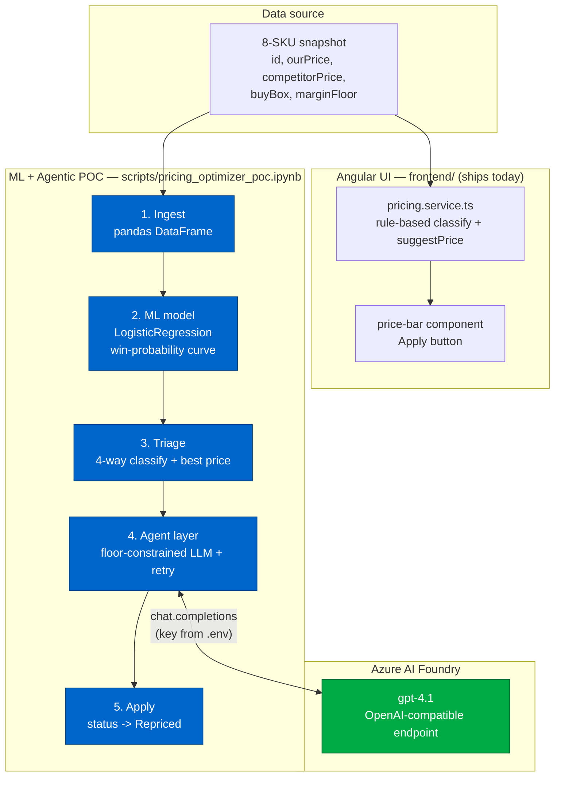
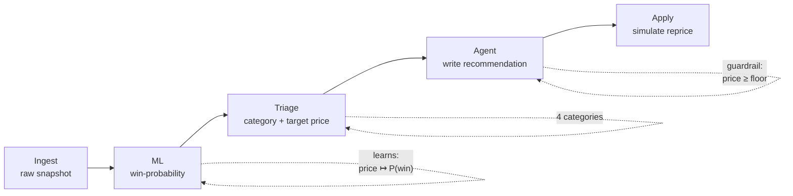
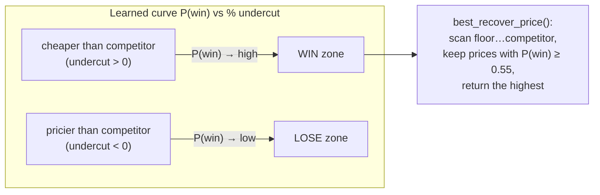
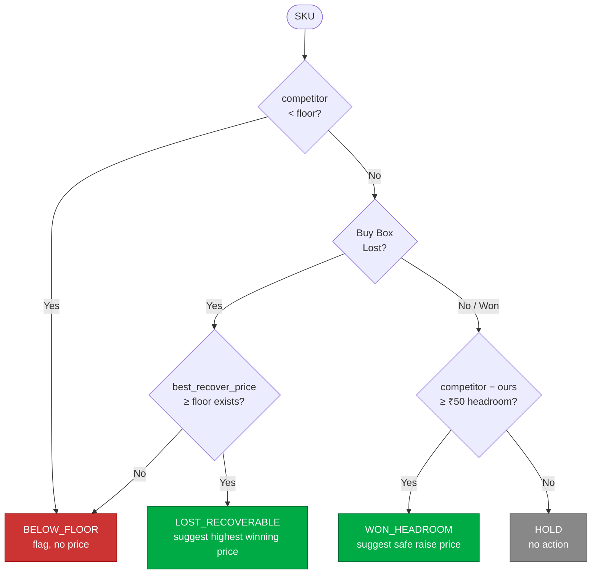
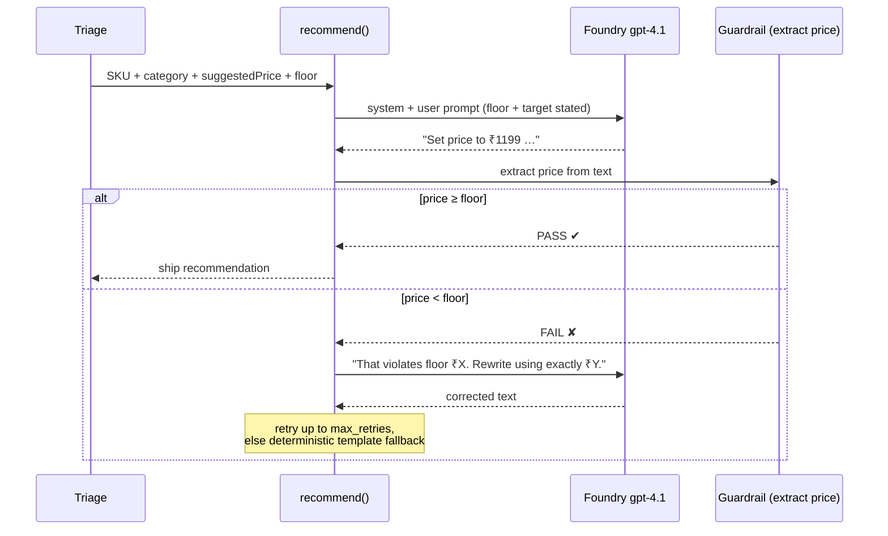
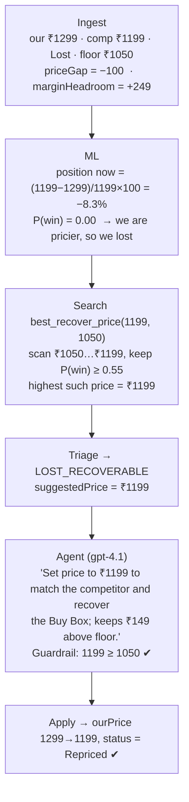
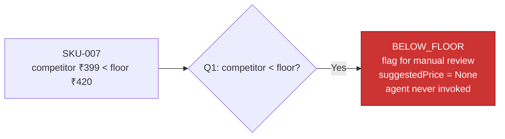

# Opptra Pricing Optimizer — Architecture

> **One line:** Turn a snapshot of competitor prices into *decisions* ("set SKU-001 to ₹1199, recover the Buy Box, stay ₹149 above floor") instead of *more dashboards*.

The product exists in two aligned layers:

| Layer | Lives in | Role |
|---|---|---|
| **Angular UI** | `frontend/` | Fast, deterministic, rule-based triage + one-click apply. Ships today. |
| **ML + Agentic POC** | `scripts/pricing_optimizer_poc.ipynb` | Replaces the hand-rules with a learned win-probability model and an LLM agent that writes the manager-ready recommendation. Proves the next version. |

Both share the **same 8-SKU snapshot**, the **same 4 triage categories**, and the **same margin-floor guardrail** — so the notebook is a drop-in upgrade path for the service, not a separate experiment.

---

## 1. System architecture

---

## 2. The pipeline (5 stages)

| # | Stage | Notebook cell | What it produces |
|---|---|---|---|
| 1 | **Ingest** | `SKU_SNAPSHOT → df` | Structured frame + `priceGap`, `marginHeadroom` |
| 2 | **ML** | `LogisticRegression` | `win_probability(price, competitor)` — a continuous curve |
| 3 | **Triage** | `triage()` | `category` ∈ {LOST_RECOVERABLE, WON_HEADROOM, BELOW_FLOOR, HOLD} + `suggestedPrice` |
| 4 | **Agent** | `recommend()` | One-sentence, floor-safe recommendation (LLM, with retry guardrail) |
| 5 | **Apply** | `apply_reprice()` | State flip to `Repriced` (simulated marketplace write) |

---

## 3. Stage 2 — the ML model (the heart of the upgrade)

A tiny **logistic regression** learns how *relative price position* maps to **winning the Buy Box**.

- **Feature:** `price_position = (competitor − ours) / competitor × 100` — percentage undercut.
  *(The `× 100` matters: raw fractions are ~0.1 and get washed out by regularisation, flattening the curve so it never crosses the win target. Scaling to percent lets the model fit a sharp boundary.)*
- **Label:** `1` if we won the Buy Box, else `0`.
- **Why ML over a rule?** It answers search questions a single `if` can't:
  - *"What is the **highest** price that still wins?"* → recover the Buy Box with **minimum** margin loss.
  - *"How much can I raise before I risk losing it?"* → capture headroom safely.

**Calibration after the fix** (`WIN_TARGET = 0.55`):

| SKU | Buy Box | `winProbNow` | Interpretation |
|---|---|---|---|
| SKU-002 / 004 / 006 | Won | 0.86 / 0.92 / 1.00 | Correctly confident wins |
| SKU-001 / 003 / 008 | Lost | 0.00 | Correctly low — needs a price cut to recover |
| SKU-005 | Lost | 0.21 | Marginal loss |
| SKU-007 | Lost | 0.00 | Lost **and** unrecoverable (see edge case) |

---

## 4. Stage 3 — triage decision tree

Only `LOST_RECOVERABLE` and `WON_HEADROOM` are **actionable** and flow to the agent. `BELOW_FLOOR` is flagged for a human; `HOLD` is left alone.

---

## 5. Stage 4 — the agentic layer (what makes it real AI)

The agent is **not** free-form text generation. Two guardrails make it production-shaped:

1. **Constrained input** — the model is told the exact margin floor and the ML-derived target price.
2. **Validation loop** — the agent's reply is parsed back to a number; **anything below floor is rejected and retried** with a stricter instruction. A sub-floor recommendation is a *failure*, so it can never ship.

**No keys? Still runs.** If `.env` has no Foundry credentials, `recommend()` falls back to a deterministic template (`_template_reco`) so the whole notebook executes end-to-end.

---

## 6. Worked example — SKU-001 end to end

**Input row:**

| field | value |
|---|---|
| ourPrice | ₹1299 |
| competitorPrice | ₹1199 |
| buyBox | Lost |
| marginFloor | ₹1050 |

**Step-by-step:**

**Why ₹1199 and not lower?** The model returns the *highest* price that still clears the win target — recovering the Buy Box while sacrificing the **least** margin. Dropping further would win too, but needlessly burn margin. The result still sits **₹149 above the ₹1050 floor**.

**Full run output (5 actionable SKUs):**

| SKU | category | from → to | margin vs floor | agent verdict |
|---|---|---|---|---|
| SKU-001 | LOST_RECOVERABLE | 1299 → **1199** | +149 | recover Buy Box, match competitor |
| SKU-003 | LOST_RECOVERABLE | 2499 → **2199** | +399 | recover Buy Box |
| SKU-005 | LOST_RECOVERABLE | 3799 → **3750** | +550 | recover Buy Box |
| SKU-008 | LOST_RECOVERABLE | 2199 → **2100** | +350 | recover Buy Box |
| SKU-006 | WON_HEADROOM | 1150 → **1390** | +490 | raise price, capture headroom |

---

## 7. Edge case — SKU-007 (the guardrail proof)

| field | value |
|---|---|
| ourPrice | ₹449 |
| competitorPrice | ₹399 |
| marginFloor | ₹420 |

The competitor (₹399) is **below our floor** (₹420). Matching them would mean selling at a loss.

Outcome: classified `BELOW_FLOOR`, **no price is ever suggested**, the LLM is never even called, and `apply_reprice()` would refuse it. This is the system proving it will *never* recommend an unprofitable price.

---

## 8. Notebook ↔ product mapping

| Pipeline step | Notebook (POC) | Production (Angular) |
|---|---|---|
| Ingest | `SKU_SNAPSHOT` → `df` | `data/skus.ts` |
| Win signal | `LogisticRegression` (learned) | implicit in hand-rules |
| Suggest price | `best_recover_price` / `safe_raise_price` (search over curve) | `suggestPrice()` (fixed ₹10 undercut) |
| Triage | `triage()` | `classify()` in `pricing.service.ts` |
| Recommendation | `recommend()` — Foundry LLM + retry guardrail | (rule text) |
| Apply | `apply_reprice()` | `price-bar` component Apply button |

**The upgrade in one sentence:** the notebook swaps the fixed-rule `suggestPrice` for a *learned* best-price search, and adds an LLM agent that explains the tradeoff in manager language — both still bounded by the same margin floor.

---

## 9. Security & configuration

- Foundry credentials load from `scripts/.env` (git-ignored) — `FOUNDRY_ENDPOINT`, `FOUNDRY_API_KEY`, `FOUNDRY_MODEL`.
- The notebook never hardcodes the key; missing credentials degrade gracefully to the deterministic template.
- Environment: the `script-poc` venv / Jupyter kernel (`pandas`, `scikit-learn`, `openai`).
